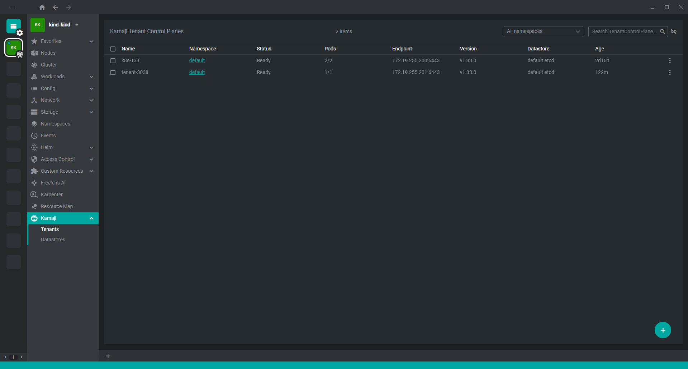
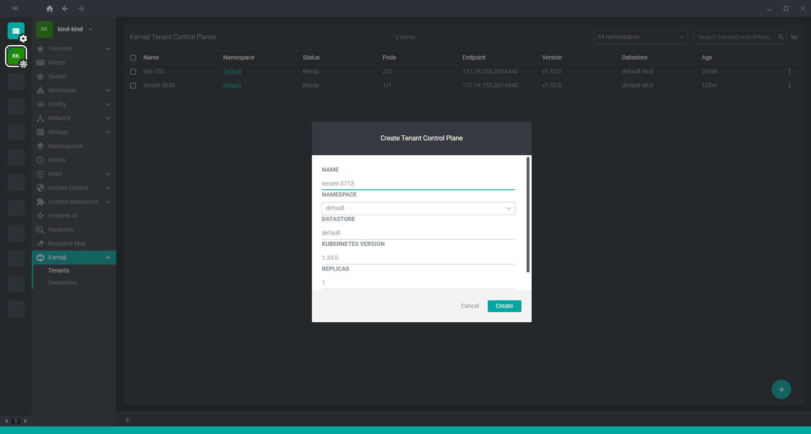
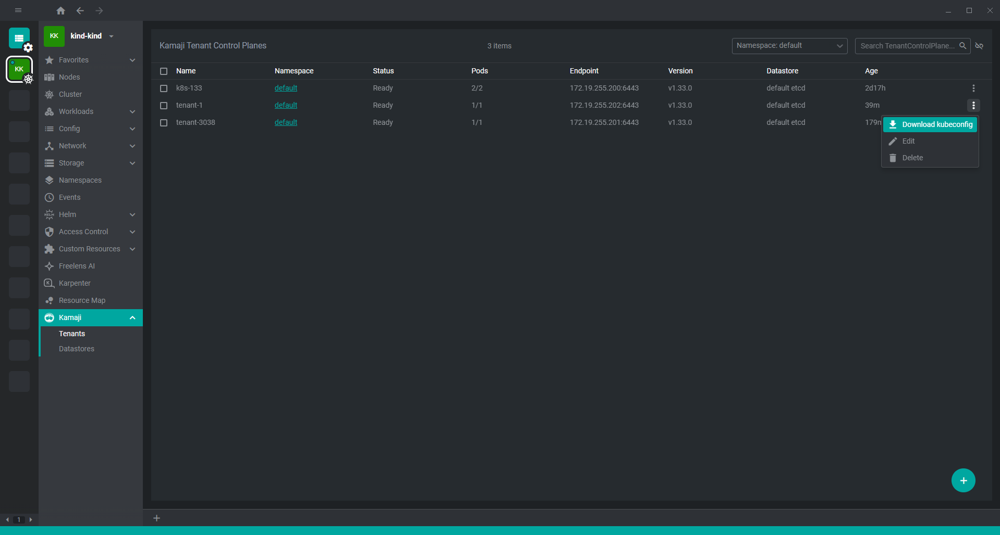
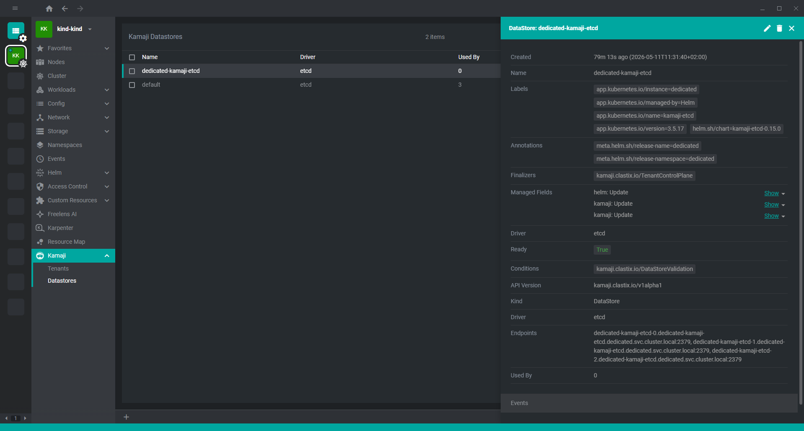

# @freelensapp/kamaji-extension

<!-- markdownlint-disable MD013 -->

[](https://freelens.app)
[](https://github.com/freelensapp/freelens-kamaji-extension)
[](https://github.com/freelensapp/freelens-kamaji-extension)
[](https://github.com/freelensapp/freelens-kamaji-extension/actions/workflows/integration-tests.yaml)
[](https://www.npmjs.com/package/@freelensapp/kamaji-extension)

<!-- markdownlint-enable MD013 -->

Freelens extension for [Kamaji](https://kamaji.clastix.io).

A visual interface to manage Kamaji resources directly from your cluster view in Freelens.

## Compatibility

This extension is intended for clusters where Kamaji CRDs are installed and available.

## Features

The extension provides complete resource management for Kamaji with the following capabilities:

- **Tenant Control Planes**: Create, Read, Update, Delete (CRUD) operations with kubeconfig download
- **Datastores**: Create, Read, Update, Delete (CRUD) operations
- **Admin Access**: Export tenant kubeconfig for external cluster access

### Tenants list



Displays Kamaji Tenant Control Planes with key runtime details:
- Tenant name and namespace
- Provisioning status
- Pod readiness
- Control plane endpoint
- Kubernetes version and datastore info

### Create tenant



Create Tenant Control Planes through a guided form:
- Name, namespace, and replicas
- Kubernetes version selection
- Datastore selection
- Advanced network fields (Service CIDR, Pod CIDR, DNS)

### Download tenant kubeconfig



Download the tenant admin kubeconfig directly from the tenant context menu.

### Datastore details



Inspect datastore configuration and usage details:
- Driver type
- Endpoints
- Number of tenants using the datastore

## Install

To install or upgrade: open Freelens and go to Extensions (`ctrl`+`shift`+`E`
or `cmd`+`shift`+`E`), and install `@freelensapp/kamaji-extension`.

or:

Use the following URL in the browser:
[freelens://app/extensions/install/%40freelensapp%2Fkamaji-extension](freelens://app/extensions/install/%40freelensapp%2Fkamaji-extension)

## Build from source

### Prerequisites

Use [NVM](https://github.com/nvm-sh/nvm) or
[mise-en-place](https://mise.jdx.dev/) or
[windows-nvm](https://github.com/coreybutler/nvm-windows) to install the
required Node.js version.

From the root of this repository:

```sh
nvm install
# or
mise install
# or
winget install CoreyButler.NVMforWindows
nvm install 22.14.0
nvm use 22.14.0
```

Install Pnpm:

```sh
corepack install
# or
curl -fsSL https://get.pnpm.io/install.sh | sh -
# or
winget install pnpm.pnpm
```

### Build extension

```sh
corepack pnpm i
corepack pnpm build
corepack pnpm pack
```

### Install built extension

The tarball for the extension will be placed in the current directory.

In Freelens, navigate to the Extensions list and provide the path to the tarball
to be loaded, or drag and drop the extension tarball into the Freelens window.
After loading for a moment, the extension should appear in the list of enabled
extensions.

## License

Copyright (c) 2025-2026 Freelens Authors.

[MIT License](https://opensource.org/licenses/MIT)
